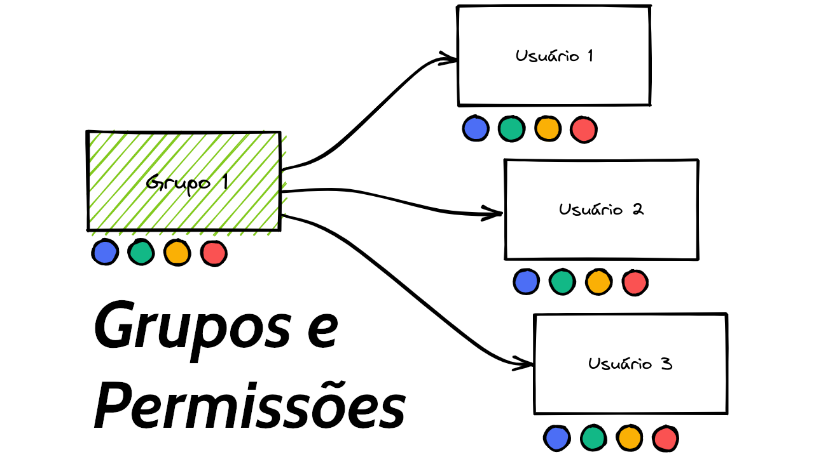

# Django Experience #14 - DRF: Grupos e Permissões



## Definindo permissões por linha de comando

Abra o `shell_plus`

```
python manage.py shell_plus
```


```python
# Cria os grupos
groups = ['Criador', 'Editor', 'Gerente', 'Infantil']
[Group.objects.get_or_create(name=group) for group in groups]

# Lê as permissões
permissions = Permission.objects.filter(codename__icontains='movie')
for perm in permissions:
    print(perm.codename)

# Função para adicionar os grupos
def add_permissions(group_name, permissions):
    group = Group.objects.get(name=group_name)
    permissions = Permission.objects.filter(codename__in=permissions)
    # Remove todas as permissões.
    group.permissions.clear()
    # Adiciona novas permissões.
    for perm in permissions:
        group.permissions.add(perm)

# Adiciona permissões aos grupos
add_permissions('Criador', ['add_movie'])
add_permissions('Editor', ['add_movie', 'change_movie'])
add_permissions('Gerente', ['add_movie', 'change_movie', 'delete_movie'])

# Cria os usuários
users = ['regis', 'criador', 'editor', 'gerente', 'pedrinho']

for user in users:
    obj = User.objects.create_user(user)
    obj.set_password('d')
    obj.save()

# Associa os usuários aos grupos
criador = User.objects.get(username='criador')
editor = User.objects.get(username='editor')
gerente = User.objects.get(username='gerente')
pedrinho = User.objects.get(username='pedrinho')

grupo_criador = Group.objects.get(name='Criador')
criador.groups.clear()
criador.groups.add(grupo_criador)

grupo_editor = Group.objects.get(name='Editor')
editor.groups.clear()
editor.groups.add(grupo_editor)

grupo_gerente = Group.objects.get(name='Gerente')
gerente.groups.clear()
gerente.groups.add(grupo_gerente)

grupo_infantil = Group.objects.get(name='Infantil')
pedrinho.groups.clear()
pedrinho.groups.add(grupo_infantil)
```
