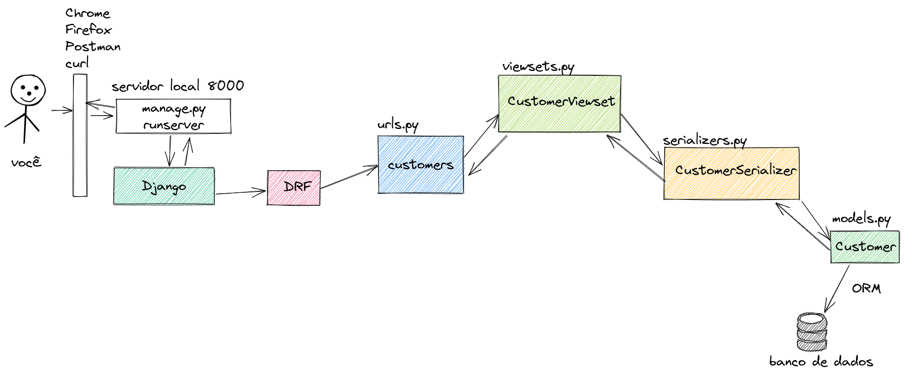
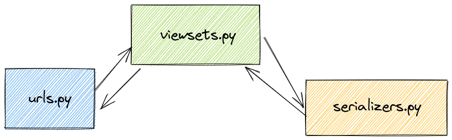

# Entendendo o Django REST framework

https://www.django-rest-framework.org/

## Teste

* Crie uma API REST.
* Crie um cadastro de **clientes**.
* Os campos são: usuário (nome, sobrenome, e-mail), vendedor (nome, sobrenome, e-mail), RG, CPF, CEP, endereço, ativo (booleano).
* Cada **cliente** pode ter um **vendedor** associado a ele, mas não é obrigatório.
* Ao **criar** um novo cliente, deve preencher os campos: usuário, RG, CPF, CEP, endereço.
* Ao **editar** um cliente, pode editar os campos: usuário (nome, sobrenome, e-mail), vendedor (nome, sobrenome, e-mail), RG, CPF, CEP, endereço.
* Retornar RG, CPF e CEP formatado com pontos e traços. Ex: 904.658.880-70
* Se eu for um Vendedor, eu só posso ver os meus clientes.
* Se eu for um Vendedor, ao cadastrar o cliente o campo "vendedor" deve ser preenchido com o usuário logado.
* Se eu for um Vendedor, só posso editar os meus clientes.

* Crie uma tabela de **comissões**.
* Os campos são: grupo e porcentagem.

* Criar um sistema de autenticação com login, logout e cadastro.

* Se eu for um Vendedor, não posso ver a tabela de comissões.
* Fazer uma validação simples de CPF e CEP para aceitar somente números.
* Criar um filtro de clientes ativos e inativos.
* Criar um sistema de busca para usuário (nome, sobrenome, e-mail), vendedor (nome, sobrenome, e-mail), RG, CPF, CEP, endereço.


## Diagrama





## Modelagem

Poderíamos usar o [dr_scaffold](https://www.dicas-de-django.com.br/45-drf-scaffold), mas vamos fazer manualmente mesmo.

<a href="https://youtu.be/UOW0CaFayFo">
    
</a>


App: CRM

```
cd backend
python ../manage.py startapp crm
cd ..
```


Edite `settings.py`

```python
# settings.py
INSTALLED_APPS = [
    ...
    'backend.crm',
]
```

Edite `urls.py`

```python
# urls.py
urlpatterns = [
    ...
    path('', include('backend.crm.urls', namespace='crm')),
]
```

Edite `crm/apps.py`

```python
# crm/apps.py
from django.apps import AppConfig


class CrmConfig(AppConfig):
    default_auto_field = 'django.db.models.BigAutoField'
    name = 'backend.crm'
```

#### Model: Customer


```
user
seller
rg
cpf
cep
address
active
```

Commission

```
group
percentage
```

Edite `crm/models.py`

```python
# crm/models.py
from django.contrib.auth.models import Group, User
from django.db import models


class Customer(models.Model):
    user = models.ForeignKey(
        User,
        on_delete=models.CASCADE,
        related_name='customers'
    )
    seller = models.ForeignKey(
        User,
        on_delete=models.SET_NULL,
        related_name='seller_customers',
        null=True,
        blank=True
    )
    rg = models.CharField(max_length=10, null=True, blank=True)
    cpf = models.CharField(max_length=11, null=True, blank=True)
    cep = models.CharField(max_length=8, null=True, blank=True)
    address = models.CharField(max_length=100, null=True, blank=True)
    active = models.BooleanField(default=True)

    class Meta:
        ordering = ('user__first_name',)
        verbose_name = 'cliente'
        verbose_name_plural = 'clientes'

    def __str__(self):
        return f'{self.user.get_full_name()}'


class Comission(models.Model):
    group = models.ForeignKey(
        Group,
        on_delete=models.CASCADE,
        related_name='comissions'
    )
    percentage = models.DecimalField(max_digits=5, decimal_places=2)

    class Meta:
        ordering = ('group__name',)
        verbose_name = 'comissão'
        verbose_name_plural = 'comissões'

    def __str__(self):
        return f'{self.group}'
```

Edite `crm/admin.py`

```python
# crm/admin.py
from django.contrib import admin

from .models import Comission, Customer


@admin.register(Customer)
class CustomerAdmin(admin.ModelAdmin):
    list_display = ('id', '__str__', 'rg', 'cpf', 'cep', 'seller', 'active')
    list_display_links = ('__str__',)
    search_fields = (
        'user__first_name',
        'user__last_name',
        'user__email',
        'seller__first_name',
        'seller__last_name',
        'seller__email',
        'rg',
        'cpf',
        'cep',
        'address',
        'active',
    )
    list_filter = ('active',)


@admin.register(Comission)
class ComissionAdmin(admin.ModelAdmin):
    list_display = ('__str__', 'percentage')
```

Edite `crm/urls.py` previamente

```python
# crm/urls.py
from django.urls import include, path
from rest_framework import routers

app_name = 'crm'

urlpatterns = [
    
]

```

```
python manage.py makemigrations
python manage.py migrate
```

## Rotas

<a href="https://youtu.be/xMUGbmuEjRM">
    
</a>


Edite `crm/urls.py`

```python
# crm/urls.py
from django.urls import include, path
from rest_framework import routers

from backend.crm.api.viewsets import ComissionViewSet, CustomerViewSet

app_name = 'crm'

router = routers.DefaultRouter()

router.register(r'comissions', ComissionViewSet)
router.register(r'customers', CustomerViewSet)

urlpatterns = [
    path('api/v1/', include(router.urls)),
]
```


## Serializers

<a href="https://youtu.be/ORvVh3xKk9o">
    
</a>


* Criar:

    * user
    * rg
    * cpf
    * cep
    * address

* Editar:

    * user.first_name
    * user.last_name
    * user.email
    * seller.first_name
    * seller.last_name
    * seller.email
    * rg
    * cpf
    * cep
    * address

* Representação
    RG, CPF e CEP com máscara

Edite `crm/api/serializers.py`

```
mkdir backend/crm/api
touch backend/crm/api/serializers.py
```

```python
# crm/api/serializers.py
from django.contrib.auth.models import User
from rest_framework import serializers

from backend.crm.models import Comission, Customer


# Digitar por ultimo
class UserSerializer(serializers.ModelSerializer):

    class Meta:
        model = User
        fields = (
            'id',
            'username',
            'first_name',
            'last_name',
            'email',
            # 'password',
            # 'last_login',
            # 'is_superuser',
            # 'is_staff',
            # 'is_active',
            # 'date_joined',
            # 'groups',
            # 'user_permissions',
        )


class CustomerSerializer(serializers.ModelSerializer):
    user = UserSerializer()

    class Meta:
        model = Customer
        fields = ('id', 'rg', 'cpf', 'cep', 'address', 'active', 'user', 'seller')
        depth = 1  # expande todas as FK

    def to_representation(self, instance):
        '''
        Representação personalizada para RG e CPF.
        '''
        data = super(CustomerSerializer, self).to_representation(instance)

        data['rg'] = f"{instance.rg[:2]}.{instance.rg[2:5]}.{instance.rg[5:8]}-{instance.rg[8:]}"
        data['cpf'] = f"{instance.cpf[:3]}.{instance.cpf[3:6]}.{instance.cpf[6:9]}-{instance.cpf[9:]}"
        data['cep'] = f"{instance.cep[:5]}-{instance.cep[5:]}"

        return data


class CustomerCreateSerializer(serializers.ModelSerializer):

    class Meta:
        model = Customer
        fields = ('user', 'rg', 'cpf', 'cep', 'address')


class CustomerUpdateSerializer(serializers.ModelSerializer):
    user = UserSerializer()

    class Meta:
        model = Customer
        fields = ('user', 'seller', 'rg', 'cpf', 'cep', 'address')

    def update(self, instance, validated_data):
        '''
        {
            "user": {
                "first_name": "Stewart",
                "email": "stewart@email.com"
            },
            "rg": "20282767X",
            "cpf": "09822559003"
        }
        '''
        # Edita user
        if 'user' in validated_data:
            user = validated_data.pop('user')
            # instance.user.username = user.get('username')
            # instance.user.first_name = user.get('first_name')
            # instance.user.last_name = user.get('last_name')
            # instance.user.email = user.get('email')

            for attr, value in user.items():
                setattr(instance.user, attr, value)

            instance.user.save()

        # Edita seller
        if 'seller' in validated_data:
            seller = validated_data.pop('seller')

            for attr, value in seller.items():
                setattr(instance.seller, attr, value)

            instance.seller.save()

        # Edita demais campos
        for attr, value in validated_data.items():
            setattr(instance, attr, value)

        instance.save()

        return instance


class ComissionSerializer(serializers.ModelSerializer):

    class Meta:
        model = Comission
        fields = ('group', 'percentage')

```

## Viewsets

<a href="https://youtu.be/Z4bYc-7q4Lw">
    
</a>

* Deve ter um serializer diferente para criar e editar.

* Sou Vendedor, só posso ver os meus clientes.
    get_queryset

* Sou Vendedor, ao cadastrar o cliente o campo `seller` deve ser preenchido com o usuário logado.
    perform_create

* Sou Vendedor, só posso editar os meus clientes.
    perform_update

Edite `crm/api/viewsets.py`

```
touch backend/crm/api/viewsets.py
```

```python
# crm/api/viewsets.py
from rest_framework import status, viewsets
from rest_framework.exceptions import ValidationError as DRFValidationError

from backend.crm.api.serializers import (
    ComissionSerializer,
    CustomerCreateSerializer,
    CustomerSerializer,
    CustomerUpdateSerializer
)
from backend.crm.models import Comission, Customer


class CustomerViewSet(viewsets.ModelViewSet):
    queryset = Customer.objects.all()
    serializer_class = CustomerSerializer

    def get_serializer_class(self):
        if self.action == 'create':
            return CustomerCreateSerializer

        if self.action == 'update' or self.action == 'partial_update':
            return CustomerUpdateSerializer

        return CustomerSerializer

    def is_seller(self, seller):
        if seller:
            groups_list = seller.groups.values_list('name', flat=True)
            return True if 'Vendedor' in groups_list else False
        return False

    def get_queryset(self):
        '''
        Vendedor só vê os seus clientes.
        '''
        seller = self.request.user
        queryset = Customer.objects.all()

        active = self.request.query_params.get('active')

        if active is not None:
            queryset = queryset.filter(active=active)

        if self.is_seller(seller):
            queryset = queryset.filter(seller=seller)
            return queryset

        return queryset

    def perform_create(self, serializer):
        '''
        Ao criar um objeto, se for Vendedor, então define seller com o usuário logado.
        '''
        seller = self.request.user

        if self.is_seller(seller):
            serializer.save(seller=seller)
        else:
            serializer.save()

    def perform_update(self, serializer):
        '''
        O Vendedor só pode editar os clientes dele.
        '''
        instance = self.get_object()

        if self.is_seller(instance.seller) and self.request.user == instance.seller:
            serializer.save()
        else:
            raise DRFValidationError('Você não tem permissão para editar este registro.')


class ComissionViewSet(viewsets.ModelViewSet):
    queryset = Comission.objects.all()
    serializer_class = ComissionSerializer
```

```
{
    "user": 2,
    "rg": "205753001",
    "cpf": "45662133460",
    "cep": "01233001",
    "address": "Rua Sem Fim"
}
```

## Novo comando

<a href="https://youtu.be/tqr23jPrqrw">
    
</a>

Vamos criar um comando para criar novos clientes.

```
python manage.py create_command core -n create_data
```

```python
# core/management/commands/create_data.py
import string
from random import choice

from django.contrib.auth.models import User
from django.core.management.base import BaseCommand
from django.utils.text import slugify
from faker import Faker

from backend.crm.models import Customer

fake = Faker()


def gen_digits(max_length):
    return str(''.join(choice(string.digits) for i in range(max_length)))


def gen_email(first_name: str, last_name: str):
    first_name = slugify(first_name)
    last_name = slugify(last_name)
    email = f'{first_name}.{last_name}@email.com'
    return email


def get_person():
    name = fake.first_name()
    username = name.lower()
    first_name = name
    last_name = fake.last_name()
    email = gen_email(first_name, last_name)

    user = User.objects.create(
        username=username,
        first_name=first_name,
        last_name=last_name,
        email=email
    )

    data = dict(
        user=user,
        rg=gen_digits(9),
        cpf=gen_digits(11),
        cep=gen_digits(8),
    )
    return data


def create_persons():
    aux_list = []
    for _ in range(6):
        data = get_person()
        obj = Customer(**data)
        aux_list.append(obj)
    Customer.objects.bulk_create(aux_list)


class Command(BaseCommand):
    help = 'Create data.'

    def handle(self, *args, **options):
        create_persons()

```

## Swagger

<a href="https://youtu.be/TytDfV3PVFU">
    
</a>


Doc: [drf-yasg](https://github.com/axnsan12/drf-yasg/)

```
pip install -U drf-yasg

pip freeze | grep drf-yasg >> requirements.txt
```

```python
# settings.py
INSTALLED_APPS = [
   ...
   'django.contrib.staticfiles',  # required for serving swagger ui's css/js files
   'drf_yasg',
   ...
]
```

```python
# urls.py
from django.contrib import admin
from django.urls import include, path
from drf_yasg import openapi
from drf_yasg.views import get_schema_view
from rest_framework import permissions

schema_view = get_schema_view(
    openapi.Info(
        title="Snippets API",
        default_version='v1',
        description="Test description",
        terms_of_service="https://www.google.com/policies/terms/",
        contact=openapi.Contact(email="contact@snippets.local"),
        license=openapi.License(name="BSD License"),
    ),
    public=True,
    permission_classes=(permissions.AllowAny,),
)

urlpatterns = [
    ...
]

# swagger
urlpatterns += [
   path('swagger/', schema_view.with_ui('swagger', cache_timeout=0), name='schema-swagger-ui'),  # noqa E501
   path('redoc/', schema_view.with_ui('redoc', cache_timeout=0), name='schema-redoc'),  # noqa E501
]
```

## Autenticação

Vamos usar o [djoser](https://www.dicas-de-django.com.br/47-djoser).

<a href="https://youtu.be/HUtG2Eg47Gw">
    
</a>


* Login
* Logout
* Cadastro

```
pip install -U djoser
pip freeze | grep djoser >> requirements.txt
```

```python
# settings.py
INSTALLED_APPS = (
    'django.contrib.auth',
    ...
    'rest_framework',
    'rest_framework.authtoken',  # <-- rode python manage.py migrate
    'djoser',  # <--
    ...
)

REST_FRAMEWORK = {
    'DEFAULT_AUTHENTICATION_CLASSES': (
        'rest_framework.authentication.BasicAuthentication',
        'rest_framework.authentication.TokenAuthentication',
    ),
    'DEFAULT_PERMISSION_CLASSES': (
        'rest_framework.permissions.IsAuthenticated',
    )
}
```

```python
# urls.py

# djoser
urlpatterns += [
    path('api/v1/', include('djoser.urls')),
    path('api/v1/auth/', include('djoser.urls.authtoken')),
]
```


### Login

https://djoser.readthedocs.io/en/latest/getting_started.html#available-endpoints

endpoint

http://localhost:8000/api/v1/auth/token/login/


### Logout

endpoint

http://localhost:8000/api/v1/auth/token/logout/


### Cadastro

http://localhost:8000/api/v1/users/

`--data 'username=huguinho&password=senha9090'`


## Permissões

<a href="https://youtu.be/-sL-CvveFEw">
    
</a>


* Sou Vendedor, mas não posso ver a tabela de comissões.

```python
# crm/api/viewsets.py
from rest_framework import status, viewsets
from rest_framework.exceptions import ValidationError as DRFValidationError
from rest_framework.permissions import BasePermission


class NotSellerPermission(BasePermission):
    message = 'Você não tem permissão para visualizar este registro.'

    def is_seller(self, seller):
        if seller:
            groups_list = seller.groups.values_list('name', flat=True)
            return True if 'Vendedor' in groups_list else False
        return False

    def has_permission(self, request, view):
        seller = request.user

        if self.is_seller(seller):
            response = {
                'message': self.message,
                'status_code': status.HTTP_403_FORBIDDEN
            }
            raise DRFValidationError(response)
        else:
            return True


class ComissionViewSet(viewsets.ModelViewSet):
    queryset = Comission.objects.all()
    serializer_class = ComissionSerializer
    permission_classes = (NotSellerPermission,)
```


## Validações

<a href="https://youtu.be/agBvNIrGyow">
    
</a>


* Validar o CPF, somente número
* Validar o CEP, somente número

```python
# crm/api/serializers.py
def only_numbers_validator(value):
    if not value.isnumeric():
        raise serializers.ValidationError('Digitar somente números.')


class CustomerUpdateSerializer(serializers.ModelSerializer):
    user = UserSerializer()
    cpf = serializers.CharField(validators=[only_numbers_validator])
    cep = serializers.CharField(validators=[only_numbers_validator])
```


## Paginação

<a href="https://youtu.be/UqES8tphzsQ">
    
</a>


```python
# settings.py
REST_FRAMEWORK = {
    ...
    'DEFAULT_PAGINATION_CLASS': 'rest_framework.pagination.PageNumberPagination',
    'PAGE_SIZE': 10,
}
```

## Filtro

<a href="https://youtu.be/J8mKLw_Txok">
    
</a>


* Filtrar ativos ou inativos

```python
# crm/api/viewsets.py
    def get_queryset(self):
        '''
        Vendedor só vê os seus clientes.
        '''
        seller = self.request.user
        queryset = Customer.objects.all()

        active = self.request.query_params.get('active')

        if active is not None:
            queryset = queryset.filter(active=active)

        if self.is_seller(seller):
            queryset = queryset.filter(seller=seller)
            return queryset

        return queryset
```

## Campo de busca

`first_name, last_name, email, rg, cpf, cep, address`

```python
# settings.py
REST_FRAMEWORK = {
    'DEFAULT_FILTER_BACKENDS': ['django_filters.rest_framework.DjangoFilterBackend']
}
```

```python
# crm/api/viewsets.py
from rest_framework.filters import SearchFilter


class CustomerViewSet(viewsets.ModelViewSet):
    queryset = Customer.objects.all()
    serializer_class = CustomerSerializer
    filter_backends = (SearchFilter,)
    search_fields = (
        'user__first_name',
        'user__last_name',
        'user__email',
        'seller__first_name',
        'seller__last_name',
        'seller__email',
        'rg',
        'cpf',
        'cep',
        'address',
    )
```

```
http://localhost:8000/api/v1/customers/?search=regis
```

