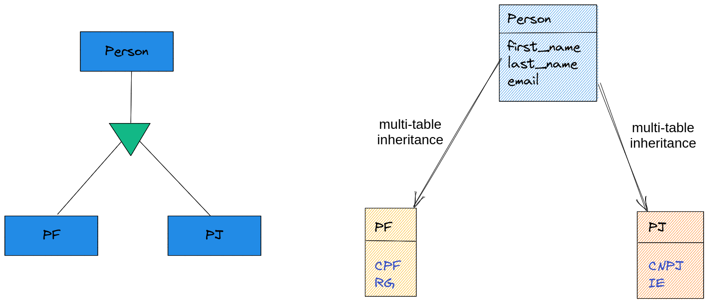
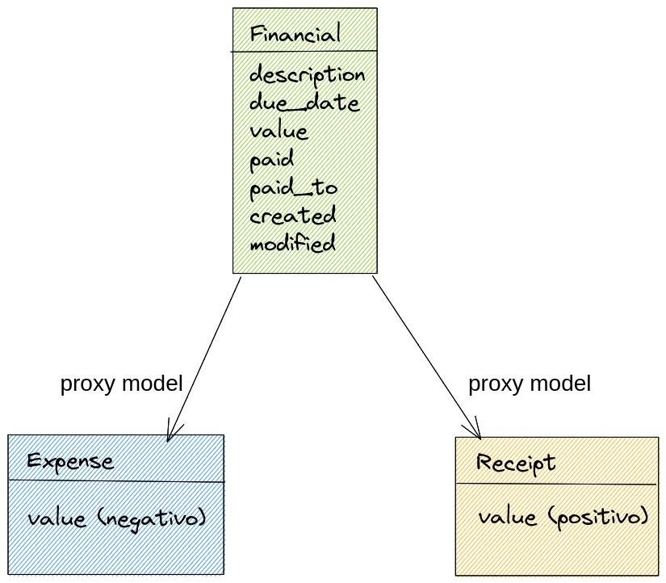

# Django Experience #21 - Modelagem de Banco de Dados no Django

<a href="">
    
</a>

## Leia

* [https://simpleisbetterthancomplex.com/tutorial/2016/07/22/how-to-extend-django-user-model.html](https://simpleisbetterthancomplex.com/tutorial/2016/07/22/how-to-extend-django-user-model.html)


## Criando uma nova app

Vamos criar uma nova app chamada `bookstore`.

```
cd backend
python ../manage.py startapp bookstore
cd ..
```

Adicione em `INSTALLED_APPS`

```python
# settings.py
INSTALLED_APPS = [
    ...
    'backend.bookstore',
]
```

Edite `urls.py`

```python
# urls.py
...
path('', include('backend.bookstore.urls', namespace='bookstore')),
```

Edite `bookstore/apps.py`

```python
# bookstore/apps.py
...
name = 'backend.bookstore'
```

Crie `bookstore/urls.py`

```python
# bookstore/urls.py
from django.urls import include, path
from rest_framework import routers

app_name = 'bookstore'

router = routers.DefaultRouter()

# router.register(r'books', BookViewSet, basename='book')
# Lição de casa: completar a parte do viewsets e serializers.

urlpatterns = [
    path('api/v1/', include(router.urls)),
]
```

## Criando app persona

Vamos criar uma nova app chamada `persona`.

```
cd backend
python ../manage.py startapp persona
cd ..
```

Adicione em `INSTALLED_APPS`

```python
# settings.py
INSTALLED_APPS = [
    ...
    'backend.persona',
]
```

Edite `urls.py`

```python
# urls.py
...
path('', include('backend.persona.urls', namespace='persona')),
```

Edite `persona/apps.py`

```python
# persona/apps.py
...
name = 'backend.persona'
```

Crie `persona/urls.py`

```python
# persona/urls.py
from django.urls import include, path
from rest_framework import routers

app_name = 'persona'

router = routers.DefaultRouter()

# router.register(r'customers', CustomerViewSet, basename='customer)
# Lição de casa: completar a parte do viewsets e serializers.

urlpatterns = [
    path('api/v1/', include(router.urls)),
]
```


## OneToMany - Um pra Muitos - Foreign Key - Chave Estrangeira


## OneToOne - Um pra Um


## ManyToMany - Muitos pra Muitos


## Abstract Inheritance - Herança Abstrata


## Multi-table Inheritance - Herança Multi-tabela




## Proxy Model



